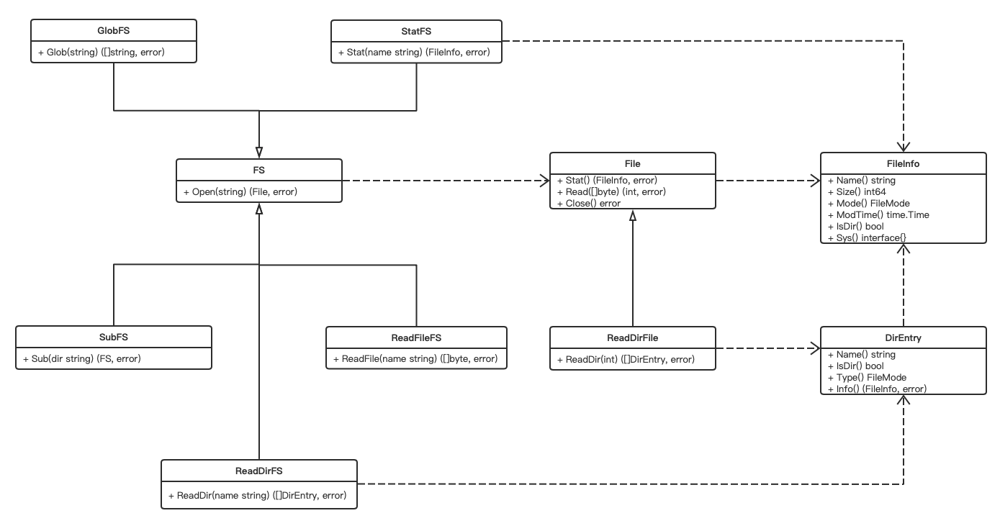

# 6.3 io/fs — 抽象文件系统 #

Go 语言从 1.16 开始增加了 io/fs 包，该包定义了一个文件系统需要的相关基础接口，因此我们称之为抽象文件系统。该文件系统是层级文件系统或叫树形文件系统，Unix 文件系统就是这种类型。

本节除了讲解标准库的相关内容，还会实现一个文件系统作为例子。

> 注意，因为抽象了一个文件系统，之前 os 包中和文件系统相关的功能都移到 io/fs 包了，os 中的原类型只是 io/fs 对应类型的别名。如果你的系统要求 Go1.16，应该优先使用 io/fs 包。

## 三个核心接口 ##

一个文件系统有些必要的元素，io/fs 包提供两个最小的接口来表示，即 fs.FS 和 fs.File。但因为 fs.File 依赖 fs.FileInfo 接口，因此实际上是三个接口。

### fs.FS ###

该接口提供了对层级文件系统的访问。一个文件系统的最低要求是必须实现 fs.FS 接口，但一般还会实现额外的接口，比如 ReadFileFS，该接口在后文讲解。

```go
type FS interface {
    // Open opens the named file.
    //
    // When Open returns an error, it should be of type *PathError
    // with the Op field set to "open", the Path field set to name,
    // and the Err field describing the problem.
    //
    // Open should reject attempts to open names that do not satisfy
    // ValidPath(name), returning a *PathError with Err set to
    // ErrInvalid or ErrNotExist.
    Open(name string) (File, error)
}
```

该接口只有一个方法，即打开一个命名文件，该方法的实现要求如下：

- 如果 Open 方法出错，应该返回 `*PathError` 类型的错误，该类型定义如下：

```go
type PathError struct {
    Op   string
    Path string
    Err  error
}
```

返回该类型错误时，Op 字段设置为 "open"，Path 字段设置为文件名，而 Err 字段描述错误原因。

注：在 os 那小节提到过该类型，Go 1.16 后，`os.PathError` 只是 `fs.PathError` 的别名。

```go
type PathError = fs.PathError
```

- 对于指定的文件名，需要满足 `ValidPath(name)` 函数，如果不满足，则返回 `*PathError` 的 Err 为 fs.ErrInvalid 或 fs.ErrNotExist 的错误。

```go
func ValidPath(name string) bool
```

传递给该函数的 name 应该是一个非根，且是 `/` 分隔的，例如 `x/y/z`。除了只包含 `.`，其他情况不能有 `.` 和 `..`。

因为 Open 方法返回一个 fs.File 接口类型，因此一个文件系统只实现 fs.FS 还不够，需要同时实现 fs.File 接口。

### fs.File ###

该接口提供对单个文件的访问。File 接口是文件的最低实现要求。一个文件可以实现其他接口，例如fs.ReadDirFile，fs.ReaderAt 或 fs.Seeker，以提供额外或优化的功能。

```go
type File interface {
    Stat() (FileInfo, error)
    Read([]byte) (int, error)
    Close() error
}
```

通过 fs.FS 接口的 Open 打开文件后，通过 fs.File 接口的 Read 方法进行读操作，这个方法和 io.Reader 接口的 Read 方法签名一样。

对操作系统有所了解的读者应该知晓（特别是 Unix 系统），目录也是文件，只是特殊的文件。因此，在遍历文件目录树时，我们通常需要判断文件是什么类型，也可能需要获取文件的一些元数据信息，比如文件名、大小、修改时间等，而这就是 Stat 方法的功能。该方法会返回一个 FileInfo 类型，它也是一个接口。这就是文件系统需要实现的第三接口，稍后讲解。

在 Go 中，你应该始终记住，打开文件，进行操作后，记得关闭文件，否则会泄露文件描述符。所以，fs.File 的第是三个方法就是 Close 方法，它的签名和 io.Closer 是一致的。

### fs.FileInfo ###

该接口描述一个文件的元数据信息，它由 Stat 返回。为了方便，在 io/fs 包有一个 Stat 函数：

```go
func Stat(fsys FS, name string) (FileInfo, error)
```

该函数接受任意的 FS 文件系统和该系统下的任意一个文件。如果 fsys 实现了 StatFS，则直接通过 StatFS 的 Stat 方法获取 FileInfo，否则需要 Open 文件，然后调用 File 的 Stat 方法来获取 FileInfo。关于 fs.StatFS 接口后文讲解。

本节开头提到了，Go1.16 开始，os 包中和文件系统相关的类型移到 io/fs 包中了，fs.FileInfo 就是其中之一。因为在 os 中已经讲过该接口了，此处不再赘述。

## 实现一个文件系统 ##

介绍完这三个核心接口，我们尝试实现一个文件系统。这是一个基于内存的文件系统，这个实现相对比较简陋。

### 实现 fs.File 和 fs.FileInfo ###

实现文件系统先实现这两个接口。我们通过一个类型来实现：

```go
type file struct {
	name    string
	content *bytes.Buffer
	modTime time.Time
	closed  bool
}

func (f *file) Read(p []byte) (int, error) {
	if f.closed {
		return 0, errors.New("file closed")
	}

	return f.content.Read(p)
}

func (f *file) Stat() (fs.FileInfo, error) {
	if f.closed {
		return nil, errors.New("file closed")
	}

	return f, nil
}

// Close 关闭文件，可以调用多次。
func (f *file) Close() error {
	f.closed = true
	return nil
}

// 实现 fs.FileInfo

func (f *file) Name() string {
	return f.name
}

func (f *file) Size() int64 {
	return int64(f.content.Len())
}

func (f *file) Mode() fs.FileMode {
	// 固定为 0444
	return 0444
}

func (f *file) ModTime() time.Time {
	return f.modTime
}

// IsDir 目前未实现目录功能
func (f *file) IsDir() bool {
	return false
}

func (f *file) Sys() interface{} {
	return nil
}
```

- file 同时实现 fs.File 和 fs.FileInfo；
- 文件内容放在 file 的 bytes.Buffer 类型中，它实现了 io.Reader，因此 file 的 Read 可以直接通过它实现；
- 目前是一个简化实现，因此 IsDir 未实现目录功能，只返回 false；

### 实现 fs.FS ###

实现了 fs.File，通过它可以实现 fs.FS：

```go
type FS struct {
	files map[string]*file
}

func NewFS() *FS {
	return &FS{
		files: make(map[string]*file),
	}
}

func (fsys *FS) Open(name string) (fs.File, error) {
	if !fs.ValidPath(name) {
		return nil, &fs.PathError{
			Op:   "open",
			Path: name,
			Err:  fs.ErrInvalid,
		}
	}

	if f, ok := fsys.files[name]; !ok {
		return nil, &fs.PathError{
			Op:   "open",
			Path: name,
			Err:  fs.ErrNotExist,
		}
	} else {
		return f, nil
	}
}
```

- FS 类型中的 files 存放所有的文件；
- 按照前面 Open 方法的实现要求，先通过 ValidPath 函数进行校验，接着通过 name 查找 file；

细心的读者应该会发现，io/fs 并没有提供 Write 相关的功能，那我们读什么呢？为此，我们实现一个 Write 的功能。

```go
func (fsys *FS) WriteFile(name, content string) error {
	if !fs.ValidPath(name) {
		return &fs.PathError{
			Op:   "write",
			Path: name,
			Err:  fs.ErrInvalid,
		}
	}

	f := &file{
		name:    name,
		content: bytes.NewBufferString(content),
		modTime: time.Now(),
	}

	fsys.files[name] = f

	return nil
}
```

WriteFile 方法就是生成一个 file 然后存入 files 中。

### 验证 ###

一个基于内存的文件系统已经实现完成，接下来需要验证下。

```go
func TestMemFS(t *testing.T) {
	name := "x/y/name.txt"
	content := "This is polarisxu, welcome."
	memFS := memfs.NewFS()
	err := memFS.WriteFile(name, content)
	if err != nil {
		t.Fatal(err)
	}

	f, err := memFS.Open(name)
	if err != nil {
		t.Fatal(err)
	}
	defer f.Close()

	fi, err := f.Stat()
	if err != nil {
		t.Fatal(err)
	}

	t.Log(fi.Name(), fi.Size(), fi.ModTime())

	var result = make([]byte, int(fi.Size()))
	n, err := f.Read(result)
	if err != nil {
		t.Fatal(err)
	}

	if string(result[:n]) != content {
		t.Errorf("expect: %s, actual: %s", content, result[:n])
	}
}
```

如果测试通过，说明基于内存的简单文件系统已经完成。至于缺失的功能，本节后面再完善。

## 增强型接口 ##

上面实现的内存文件系统中，目录功能是有问题的，比如我们没法遍历整个文件系统。要实现一个更完整的文件系统，需要实现 io/fs 包中的其他接口。

### fs.DirEntry 和相关接口 ###

在文件系统中，一个目录下可能会有子目录或文件，这称为 entry，在 io/fs 包中用 DirEntry 接口表示：

```go
type DirEntry interface {
	// Name returns the name of the file (or subdirectory) described by the entry.
	// This name is only the final element of the path (the base name), not the entire path.
	// For example, Name would return "hello.go" not "/home/gopher/hello.go".
	Name() string

	// IsDir reports whether the entry describes a directory.
	IsDir() bool

	// Type returns the type bits for the entry.
	// The type bits are a subset of the usual FileMode bits, those returned by the FileMode.Type method.
	Type() FileMode

	// Info returns the FileInfo for the file or subdirectory described by the entry.
	// The returned FileInfo may be from the time of the original directory read
	// or from the time of the call to Info. If the file has been removed or renamed
	// since the directory read, Info may return an error satisfying errors.Is(err, ErrNotExist).
	// If the entry denotes a symbolic link, Info reports the information about the link itself,
	// not the link's target.
	Info() (FileInfo, error)
}
```

- `Name()` 方法和 FileInfo 接口的 `Name()` 方法类似，代表的是 base name，而我们上面实现的文件系统没有处理这一点；
- `Type()` 方法返回一个 fs.FileMode，表示 entry 的位类型，关于 FileMode 的详细信息在 os 包中有讲解；
- `Info()` 方法和 Stat 有点类似，获取元数据信息；如果 entry 是软链接，Info() 返回的 FileInfo 是链接本身的信息，而不是目标文件；

为了方便遍历文件系统（目录），io/fs 包提供了 ReadDir 函数，用来获取某个目录下的所有目录项：

```go
func ReadDir(fsys FS, name string) ([]DirEntry, error)
```

对于这个函数的实现，如果第一个参数实现了 fs.ReadDirFS 接口，直接调用该接口的 ReadDir 方法：

```go
type ReadDirFS interface {
	FS

	// ReadDir reads the named directory
	// and returns a list of directory entries sorted by filename.
	ReadDir(name string) ([]DirEntry, error)
}
```

否则看是否实现了 fs.ReadDirFile 接口，没实现则报错；否则调用该接口的 ReadDir 方法：

```go
type ReadDirFile interface {
	File

	// ReadDir reads the contents of the directory and returns
	// a slice of up to n DirEntry values in directory order.
	// Subsequent calls on the same file will yield further DirEntry values.
	//
	// If n > 0, ReadDir returns at most n DirEntry structures.
	// In this case, if ReadDir returns an empty slice, it will return
	// a non-nil error explaining why.
	// At the end of a directory, the error is io.EOF.
	//
	// If n <= 0, ReadDir returns all the DirEntry values from the directory
	// in a single slice. In this case, if ReadDir succeeds (reads all the way
	// to the end of the directory), it returns the slice and a nil error.
	// If it encounters an error before the end of the directory,
	// ReadDir returns the DirEntry list read until that point and a non-nil error.
	ReadDir(n int) ([]DirEntry, error)
}
```

这个接口的 ReadDir 比 ReadDirFS 复杂多了，但 ReadDirFS 的 ReadDir 必须自己对 entry 进行排序。此外，如果目录下内容特别多，ReadDirFile 接口会更适合，它可以分段读取。而且目录应该实现 ReadDirFile 接口。

## 其他 fs.FS 相关的接口 ##

在讲解 fs.FS 接口时提到还有其他接口，用于增强 fs.FS，即嵌入了 fs.FS 接口，除了已经介绍的 ReadDirFS 接口，还有如下接口。

### fs.ReadFileFS ###

该接口的定义如下：

```go
type ReadFileFS interface {
	FS

	// ReadFile reads the named file and returns its contents.
	// A successful call returns a nil error, not io.EOF.
	// (Because ReadFile reads the whole file, the expected EOF
	// from the final Read is not treated as an error to be reported.)
	ReadFile(name string) ([]byte, error)
}
```

也就是说这是一个支持 ReadFile 的文件系统，如果一个文件系统实现了该接口，则 fs.ReadFile 函数会先直接使用该接口的 ReadFile 方法来实现：

```go
func ReadFile(fsys FS, name string) ([]byte, error)
```

如果没实现该接口，则通过 fs.FS 的 Open 方法获取 fs.File 类型，然后调用 fs.File 的 Read 方法来实现。有兴趣可以查看 fs.ReadFile 函数的实现。

### fs.StatFS ###

该接口的定义如下：

```go
type StatFS interface {
	FS

	// Stat returns a FileInfo describing the file.
	// If there is an error, it should be of type *PathError.
	Stat(name string) (FileInfo, error)
}
```

如果一个文件系统支持 Stat 功能，则 fs.Stat 函数会优先使用该文件系统的 Stat 方法，否则通过 fs.FS 的 Open 方法获取 fs.File 类型，然后调用 fs.File 的 Stat 方法来实现。

### fs.GlobFS ###

该接口的定义如下：

```go
type GlobFS interface {
	FS

	// Glob returns the names of all files matching pattern,
	// providing an implementation of the top-level
	// Glob function.
	Glob(pattern string) ([]string, error)
}
```

类似的，实现了该接口，表示文件系统支持 Glob 方法。对应的，io/fs 提供了 Glob 函数：

```go
func Glob(fsys FS, pattern string) (matches []string, err error)
```

- 这是用于文件模式匹配的；
- 语法和 path.Match 相同；
- 模式（pattern）可以描述层级，比如：/usr/*/bin/ed；
- 该函数会忽略文件系统错误，比如 IO 错误；唯一的错误是模式语法错误；

和其他 fs.FS 相关接口对应的函数一样，Glob 函数内部实现优先调用 fs.GlobFS 接口，如果没实现该接口，则使用 ReadDir 遍历目录树来查找匹配的目标。

### fs.SubFS ###

该接口的定义如下：

```go
type SubFS interface {
	FS

	// Sub returns an FS corresponding to the subtree rooted at dir.
	Sub(dir string) (FS, error)
}
```

这个接口的作用主要是让一个文件系统支持定义子文件系统。io/fs 包也提供了一个相应的函数 Sub：

```go
func Sub(fsys FS, dir string) (FS, error)
```

通过该函数可以获得一个子文件系统，该子文件系统的根由第二个参数 `dir` 指定。

类似的，该函数的实现会优先判断 fsys 是否实现了 fs.SubFS 接口，以便调用其 Sub 方法。如果未实现，同时 dir 是 `.`，则原样返回 fsys，否则返回一个新实现的 fs.FS。

不过有一点需要注意，对于 os 实现的 fs.FS 文件系统（磁盘文件系统），Sub 并不能提到 chroot 的进制，它不会限制子文件系统根之外的操作，典型的，子文件系统内部的文件软连到根之外，Sub 得到的子文件系统不会阻止这种行为。

查看 fs.Sub 函数的源码可以发现，如果 fsys 没有实现 fs.SubFS，Sub 函数返回的 FS 实现了不少 FS 相关接口。

### 设计思想 ###

上面啰啰嗦嗦讲了好几个 fs.FS 相关接口，其中目的之一是希望理解其设计思想。

io/fs 包中和 fs.FS 相关的接口如下：

- fs.ReadDirFS
- fs.ReadFileFS
- fs.StatFS
- fs.SubFS
- fs.GlobFS

Go 以简单著称，大道至简。Go 强调定义小接口。fs.FS 接口只有一个方法：Open，其他 fs.FS 相关接口都内嵌了 fs.FS 接口，以此来扩展文件系统的功能。同时 io/fs 包辅以相关便捷函数（比如 Stat、Sub、Glob 等），达到操作 fs.FS 的目的。

## 完善内存文件系统 ##

是时候完善我们上面实现的内存文件系统了。

前面只是实现了文件的写入、读取，并没有实现文件系统该有的目录树。现在补充完善这部分内容，实现一个较完整的内存文件系统。具体看代码前，看看如何设计。

### 如何设计 ###

先通过一个类图表示 io/fs 包相关接口的关系。



要基于这些接口实现一个文件系统，我们需要先了解一些文件系统相关的知识（前面有提到，这里总结下）。

- 文件系统是一个树形结构，有一个根目录；
- 一个目录下的目录项，可以是文件或子目录；
- 一切皆文件，所以目录也是文件；（虽然如此，但两者还是有不小区别，因此实现时不一定适合使用嵌入）

所以，我们在实现 fs.FS 接口时，定义的类型 FS 有一个根目录字段：

```go
type FS struct {
	rootDir *dir
}
```

#### 文件的实现 ####

从上面类图可以看出，一个文件需要实现 fs.File 接口，同时因为该接口依赖 fs.FileInfo 接口，我们可以选择用一个单独的类型实现 fs.FileInfo 接口，也可以直接用这个文件类型（file）实现该接口，内存文件系统直接使用文件类型实现了 fs.FileInfo 接口。此外，一个文件还是其所在目录的目录项，因此还需要实现 fs.DirEntry 接口。因此内存文件系统的 file 类型实现了以下接口：

- fs.File
- fs.FileInfo
- fs.DirEntry

具体如何实现这些接口，需要先思考一个问题：文件内容用什么表示？因为是内存文件系统，因此一切都在内存中。文件内容本质上是字节数组，但因为要实现 fs.File 接口，这其中关键的是 Read 方法，它的签名和 io.Reader 接口的 Read 方法是一样的，因此在 file 类型中，我们用一个 bytes.Buffer 字段来存放文件内容。

至于其他接口的实现相对较简单，这里不赘述。值得一提的是，因为 file 类型实现了 fs.FileInfo 接口，所以在实现 Stat 方法时，直接返回 file 的实例即可。

#### 目录的实现 ####

对于目录，我们用类型 dir 表示，它首先是其所在目录的目录项，因此需要实现 fs.DirEntry 接口；其次目录也是文件，因此它需要实现 fs.File 接口。同时，读取目录的内容，即读取其目录项，不应该通过 Read 读取，而 fs.ReadDirFile 接口是用来读目录的，因此 dir 应该实现它。同样的，因为 fs.DirEntry 和 fs.File 都依赖 fs.FileInfo 接口，跟 file 一样，我们不单独实现，而是让 dir 直接实现它。因此内存文件系统的 dir 类型实现了以下接口：

- fs.DirEntry
- fs.File
- fs.ReadDirFile
- fs.FileInfo

因为目录涉及到有目录项，构成了一个树形结构。这里使用一个 map 来存放所有的目录项，key 是目录项的名称，value 是目录项的实例。

```go
// dir 代表一个目录
type dir struct {
	name    string
	modTime time.Time

	// 存放该目录下的子项，value 可能是 *dir 或 *file
	children map[string]fs.DirEntry
}
```

因为 Read 对于目录来说没有实际价值，因此它的实现返回错误即可。dir 的难点在于实现 fs.ReadDirFile 接口中的 ReadDir 方法：给定一个目录，该方法需要返回该目录下的所有目录项。而且，根据 fs.ReadDirFile 中 ReadDir 方法的实现要求，它应该支持分步读取目录项。所以，在 dir 类型中增加一个字段：idx，用来表示当前读取到什么位置的目录项了。具体实现代码见后文。

#### fs.FS 接口的实现 ####

对于内存文件系统，如何实现 Open 方法呢？我们需要根据参数 name 在文件系统的目录树中找到该文件所在位置。因此，我们将该文件用 `/` 分隔，从左到右，一部分一部分，从文件系统的根开始，在目录树中查找，直到找到对应的文件，然后返回该文件。如果没找到，返回错误。

具体来说，在遍历文件系统目录树时，如果某个目录项是文件，且是 name 的最后一部分，表示找到了该文件；如果某个目录项是目录，则递归遍历它的目录项。

#### 创建目录和文件的实现 ####

io/fs 没有定义创建目录和文件的接口，从这个维度看，io/fs 定义的文件系统是一个只读文件系统。但实际的文件系统，必然要有写入的接口。因此我们还需要实现创建目录和创建文件（写入内容）的功能。

先看创建目录的实现。

创建目录，实际上是构建一个层级关系。方法签名如下：

```go
func (fsys *FS) MkdirAll(path string) error
```

根据传入的 path，比如 `x/y/z`，能够创建对应的目录结构。因此我们将 path 通过 `/` 分隔，从左到右，一步步从文件系统的根开始在对应的层级创建目录。创建时，需要判断是否已经存在对应的目录。关键代码如下：

```go
cur := fsys.rootDir
parts := strings.Split(path, "/")
for _, part := range parts {
  child := cur.children[part]
  if child == nil {
    childDir := &dir{
      name:     part,
      modTime:  time.Now(),
      children: make(map[string]fs.DirEntry),
    }
    cur.children[part] = childDir
    cur = childDir
  } else {
    childDir, ok := child.(*dir)
    if !ok {
      return fmt.Errorf("%s is not directory", part)
    }

    cur = childDir
  }
}
```

文件的创键和内容写入通过 WriteFile 方法实现。签名如下：

```go
func (fsys *FS) WriteFile(name, content string) error
```

在非完善版本中，粗暴的直接将传递的文件名（包括路径）和 file 实例关联，没有处理目录层级关系。因此，这里的实现的关键是要找到该文件（name 对应）的目录 dir 实例。和上面创建目录的思路类似，一步步处理。

```go
// getDir 通过一个路径获取其 dir 类型实例
func (fsys *FS) getDir(path string) (*dir, error) {
	parts := strings.Split(path, "/")

	cur := fsys.rootDir
	for _, part := range parts {
		child := cur.children[part]
		if child == nil {
			return nil, fmt.Errorf("%s is not exists", path)
		}

		childDir, ok := child.(*dir)
		if !ok {
			return nil, fmt.Errorf("%s is not directory", path)
		}

		cur = childDir
	}

	return cur, nil
}
```

得到了文件应该放置的目录（dir）后，就可以构建一个 file 实例，并将该实例放置到其目录的目录项中。

```go
filename := filepath.Base(name)

dir.children[filename] = &file{
  name:    filename,
  content: bytes.NewBufferString(content),
  modTime: time.Now(),
}
```

### 完整的实现代码 ###

以下是 dir 类型的实现，代表一个目录，注意注释。

```go
// dir 代表一个目录
type dir struct {
	name    string
	modTime time.Time

	// 存放该目录下的子项，value 可能是 *dir 或 *file
	children map[string]fs.DirEntry

	// ReadDir 遍历用
	idx int
}

// dir 虽然是一个目录，但根据一切皆文件的思想，目录也是文件，因此需要实现 fs.File 接口
// 这样，fs.FS 的 Open 方法可以对目录起作用。

func (d *dir) Read(p []byte) (int, error) {
	return 0, &fs.PathError{
		Op:   "read",
		Path: d.name,
		Err:  errors.New("is directory"),
	}
}

func (d *dir) Stat() (fs.FileInfo, error) {
	return d, nil
}

func (d *dir) Close() error {
	return nil
}

// ReadDir 实现 fs.ReadDirFile 接口，方便遍历目录
func (d *dir) ReadDir(n int) ([]fs.DirEntry, error) {
	names := make([]string, 0, len(d.children))
	for name := range d.children {
		names = append(names, name)
	}

	totalEntry := len(names)
	if n <= 0 {
		n = totalEntry
	}

	dirEntries := make([]fs.DirEntry, 0, n)
	for i := d.idx; i < n && i < totalEntry; i++ {
		name := names[i]
		child := d.children[name]

		f, isFile := child.(*file)
		if isFile {
			dirEntries = append(dirEntries, f)
		} else {
			dirEntry := child.(*dir)
			dirEntries = append(dirEntries, dirEntry)
		}

		d.idx = i
	}

	return dirEntries, nil
}

// 因为 fs.Stat 对目录也是有效的，因此 dir 需要实现 fs.FileInfo 接口

func (d *dir) Name() string {
	return d.name
}

func (d *dir) Size() int64 {
	return 0
}

func (d *dir) Mode() fs.FileMode {
	return fs.ModeDir | 0444
}

func (d *dir) ModTime() time.Time {
	return d.modTime
}

func (d *dir) IsDir() bool {
	return true
}

func (d *dir) Sys() interface{} {
	return nil
}

// 因为 dir 是一个目录项，因此需要实现 fs.DirEntry 接口

func (d *dir) Type() fs.FileMode {
	return d.Mode()
}

func (d *dir) Info() (fs.FileInfo, error) {
	return d, nil
}
```

接着是 file 的实现，代表一个文件，注意注释。

```go
// file 代表一个文件
type file struct {
	name    string
	// 存放文件内容
	content *bytes.Buffer
	modTime time.Time
	closed  bool
}

// 实现 fs.File 接口

func (f *file) Read(p []byte) (int, error) {
	if f.closed {
		return 0, errors.New("file closed")
	}

	return f.content.Read(p)
}

func (f *file) Stat() (fs.FileInfo, error) {
	if f.closed {
		return nil, errors.New("file closed")
	}

	return f, nil
}

// Close 关闭文件，可以调用多次。
func (f *file) Close() error {
	f.closed = true
	return nil
}

// 实现 fs.FileInfo 接口

func (f *file) Name() string {
	return f.name
}

func (f *file) Size() int64 {
	return int64(f.content.Len())
}

func (f *file) Mode() fs.FileMode {
	// 固定为 0444
	return 0444
}

func (f *file) ModTime() time.Time {
	return f.modTime
}

func (f *file) IsDir() bool {
	return false
}

func (f *file) Sys() interface{} {
	return nil
}

// 文件也是某个目录下的目录项，因此需要实现 fs.DirEntry 接口

func (f *file) Type() fs.FileMode {
	return f.Mode()
}

func (f *file) Info() (fs.FileInfo, error) {
	return f, nil
}
```

有了目录（dir）和文件（file），看 fs.FS 的实现。

```go
// FS 是 fs.FS 的内存文件系统实现
type FS struct {
	rootDir *dir
}

// NewFS 创建一个内存文件系统的实例
func NewFS() *FS {
	return &FS{
		rootDir: &dir{
			children: make(map[string]fs.DirEntry),
		},
	}
}

// Open 实现 fs.FS 的 Open 方法
func (fsys *FS) Open(name string) (fs.File, error) {
	// 1、校验 name
	if !fs.ValidPath(name) {
		return nil, &fs.PathError{
			Op:   "open",
			Path: name,
			Err:  fs.ErrInvalid,
		}
	}

	// 2、根目录处理
	if name == "." || name == "" {
		// 重置目录的遍历
		fsys.rootDir.idx = 0
		return fsys.rootDir, nil
	}

	// 3、根据 name 在目录树中进行查找
	cur := fsys.rootDir
	parts := strings.Split(name, "/")
	for i, part := range parts {
		// 不存在返回错误
		child := cur.children[part]
		if child == nil {
			return nil, &fs.PathError{
				Op:   "open",
				Path: name,
				Err:  fs.ErrNotExist,
			}
		}

		// 是否是文件
		f, ok := child.(*file)
		if ok {
			// 文件名是最后一项
			if i == len(parts)-1 {
				return f, nil
			}

			return nil, &fs.PathError{
				Op:   "open",
				Path: name,
				Err:  fs.ErrNotExist,
			}
		}

		// 是否是目录
		d, ok := child.(*dir)
		if !ok {
			return nil, &fs.PathError{
				Op:   "open",
				Path: name,
				Err:  errors.New("not a directory"),
			}
		}
		// 重置，避免遍历问题
		d.idx = 0

		cur = d
	}

	return cur, nil
}

// MkdirAll 这不是 io/fs 的要求，但一个文件系统目录树需要可以构建
// 这个方法就是用来创建目录
func (fsys *FS) MkdirAll(path string) error {
	if !fs.ValidPath(path) {
		return errors.New("Invalid path")
	}

	if path == "." {
		return nil
	}

	cur := fsys.rootDir
	parts := strings.Split(path, "/")
	for _, part := range parts {
		child := cur.children[part]
		if child == nil {
			childDir := &dir{
				name:     part,
				modTime:  time.Now(),
				children: make(map[string]fs.DirEntry),
			}
			cur.children[part] = childDir
			cur = childDir
		} else {
			childDir, ok := child.(*dir)
			if !ok {
				return fmt.Errorf("%s is not directory", part)
			}

			cur = childDir
		}
	}

	return nil
}

// WriteFile 也不是 io/fs 的要求，和 MkdirAll 类似，文件内容也需要有接口写入
func (fsys *FS) WriteFile(name, content string) error {
	if !fs.ValidPath(name) {
		return &fs.PathError{
			Op:   "write",
			Path: name,
			Err:  fs.ErrInvalid,
		}
	}

	var err error
	dir := fsys.rootDir

	path := filepath.Dir(name)
	if path != "." {
		dir, err = fsys.getDir(path)
		if err != nil {
			return err
		}
	}
	filename := filepath.Base(name)

	dir.children[filename] = &file{
		name:    filename,
		content: bytes.NewBufferString(content),
		modTime: time.Now(),
	}

	return nil
}

// getDir 通过一个路径获取其 dir 类型实例
func (fsys *FS) getDir(path string) (*dir, error) {
	parts := strings.Split(path, "/")

	cur := fsys.rootDir
	for _, part := range parts {
		child := cur.children[part]
		if child == nil {
			return nil, fmt.Errorf("%s is not exists", path)
		}

		childDir, ok := child.(*dir)
		if !ok {
			return nil, fmt.Errorf("%s is not directory", path)
		}

		cur = childDir
	}

	return cur, nil
}
```

为了完整性，我把所有代码列出来了，关键的地方加上了注释。

## 验证正确性并学习 fs.WalkDir ##

用心的读者可能会发现，io/fs 包还有一个类型和函数没有介绍，那就是 fs.WalkDir 函数和 WalkDirFunc 类型。它们是遍历目录用的。这里通过验证上面内存文件系统的正确性来学习它们。

首先，我们使用 MkdirAll 和 WriteFile 创建如下的目录树：

```bash
├── a
│   ├── b
│   │   └── z
├── x
│   └── y
│   │   └── z
│   └── name.txt
```

即执行如下代码：

```go
memFS := memfs.NewFS()
memFS.MkdirAll("a/b/z")
memFS.MkdirAll("x/y/z")
memFS.WriteFile("x/name.txt", "This is polarisxu, welcome.")
```

基于这个目录树，我们该怎么遍历它？

### 自己实现遍历方法 ###

遍历目录树也是一个面试常考的基础题目。熟悉的朋友应该知道，这需要用到递归。基于上面的内存文件系统 API，我们实现遍历目录树。

通过 io/fs 包的 ReadDir 函数读取目录下所有目录项，然后遍历这些目录项，如果某个目录项是目录，递归处理它。

```go
func walk(fsys fs.FS, parent, base string) error {
	dirEntries, err := fs.ReadDir(fsys, filepath.Join(parent, base))
	if err != nil {
		return err
	}
	for _, dirEntry := range dirEntries {
		name := dirEntry.Name()
    fmt.Println(name)

		if dirEntry.IsDir() {
			err = walk(fsys, filepath.Join(parent, base), name)
		}
	}
	return err
}
```

然后用根目录调用它：

```go
walk(memFS, "", ".")
```

### 使用 fs.WalkDir 实现 ###

其实标准库为我们实现了这样的功能，通过它提供的方法可以很容易的实现遍历。

```go
fs.WalkDir(memFS, ".", func(path string, d fs.DirEntry, err error) error {
	fmt.Pritnln(path)
	return nil
})
```

是不是不要太简单？

关于 fs.WalkDir 和 fs.WalkDirFunc 有一大段文字说明，介绍其中的一些细节。比如在回调函数中，如果返回 fs.SkipDir，则会停止该目录的遍历。这里细说了。

## 小结

io/fs 包基本上是在 os 包的基础上抽象出来的。之所以抽象，是因为 Go1.16 的 embed 功能，它需要文件系统，但又不同于 os 的文件系统。所以做了这个抽象。

基于 io/fs 包的接口，标准库不少地方做了改动，以支持 fs.FS 接口。此外还有第三方实现了它的文件系统：

- <https://github.com/jhchabran/gistfs>：用于读取 GitHub gists 的文件；
- <https://github.com/benbjohnson/hashfs>：hash 文件，以便 HTTP Cache；
- <https://github.com/psanford/memfs>：内存文件系统的实现；本小节文件系统的实现参考了它。

# 导航 #

- 上一节：[path/filepath — 兼容操作系统的文件路径操作](06.2.md)
- 第七章：[数据持久存储与交换](/chapter07/07.0.md)
